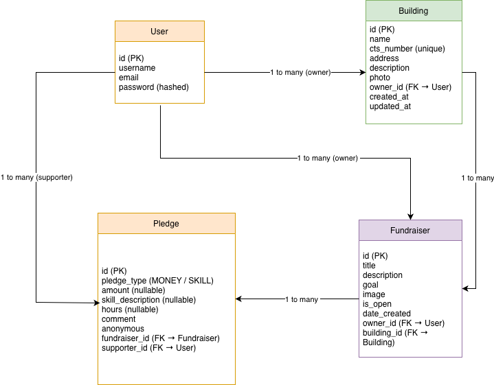
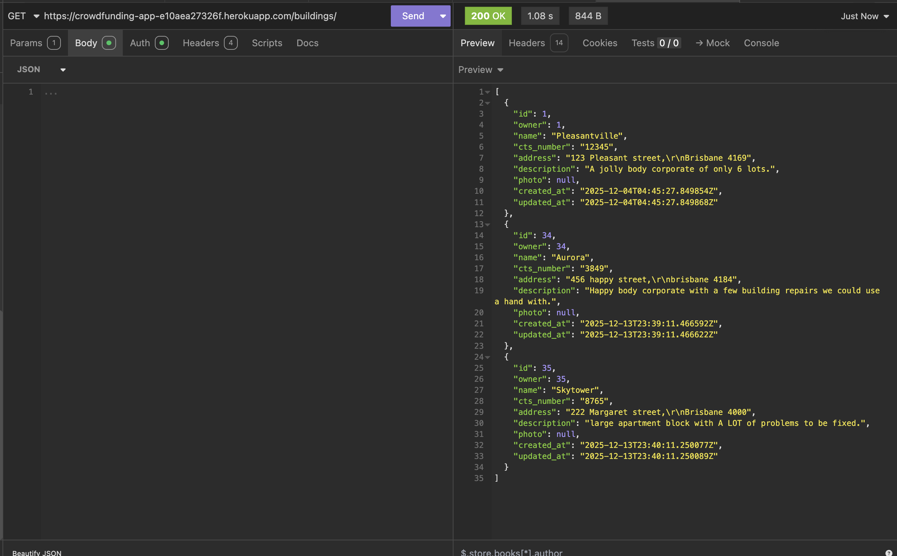
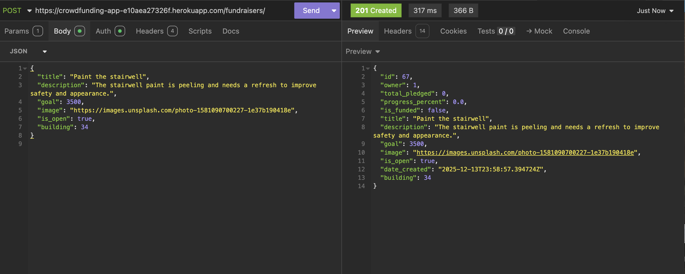
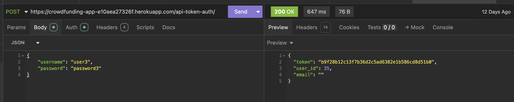

# Strata Boost - Crowdfunding backend

Arrianne O'Shea

- [Strata Boost - Crowdfunding backend](#strata-boost---crowdfunding-backend)
  - [Project Overview](#project-overview)
  - [Concept](#concept)
    - [Examples of Fundraisers](#examples-of-fundraisers)
    - [Types of Support](#types-of-support)
  - [Target Audience](#target-audience)
  - [Tech stack:](#tech-stack)
  - [Core Features](#core-features)
  - [User Accounts \& Authentication](#user-accounts--authentication)
    - [User Accounts](#user-accounts)
    - [Authentication](#authentication)
  - [User Access Rules](#user-access-rules)
  - [Anonymous Pledges](#anonymous-pledges)
  - [Fundraiser Lifecycle \& Goal Enforcement](#fundraiser-lifecycle--goal-enforcement)
    - [Automatic Closure \& Pledge Blocking](#automatic-closure--pledge-blocking)
  - [Step-by-Step Usage Guide](#step-by-step-usage-guide)
    - [1️⃣ Register a New User](#1️⃣-register-a-new-user)
  - [User Stories](#user-stories)
  - [Front End Pages/Functionality](#front-end-pagesfunctionality)
    - [Fundraisers](#fundraisers)
    - [Pledges](#pledges)
  - [API Spec](#api-spec)
    - [Users](#users)
    - [Buildings](#buildings)
    - [Fundraisers](#fundraisers-1)
    - [Pledges](#pledges-1)
  - [Database Schema](#database-schema)
  - [Deployed Project](#deployed-project)
  - [Insomnia API Testing Evidence](#insomnia-api-testing-evidence)
    - [Successful GET Request](#successful-get-request)
    - [Successful POST Request](#successful-post-request)
    - [Token Authentication Response](#token-authentication-response)
  - [Security Considerations](#security-considerations)

## Project Overview

This Django REST API enables users to create and manage fundraisers for strata and body-corporate communities. Users can pledge support using either money or trade skills.

The API is designed with a strong focus on security, permissions, and data integrity, ensuring users can only access or modify resources they are authorised to interact with.

## Concept

This backend powers a community-driven crowdfunding system for **strata buildings**.

Many buildings struggle with insufficient sinking funds, which can delay essential repairs and upgrades to common areas.

This system allows:

- Owners or residents to create fundraisers for building needs
- Anyone (residents, friends, family, tradespeople) to contribute money or skills

### Examples of Fundraisers

- Fixing roof leaks
- Painting common areas
- Rejuvenating gardens
- Installing new lighting
- Repairing stairwells

### Types of Support

- **Money pledges** — direct financial contributions
- **Skill pledges** — offering trade skills or labour

The backend handles all logic for authentication, permissions, validation, and relationships between:

- Buildings
- Fundraisers
- Pledges
- Users

## Target Audience

- Apartment owners
- Residents
- Body corporate / strata committee members
- Tradespeople and contractors
- Friends and family supporting building projects
-

## Tech stack:

- **Django**
- **Django REST Framework**
- Django REST Framework Token Authentication
- Custom object-level permissions
- Custom serializer validation logic

## Core Features

- Secure user registration and authentication
- Token-based API access
- Buildings with owner-based access control
- Fundraisers linked to buildings
- Money and skill pledges
- Automatic fundraiser closure when funding goals are reached
- Anonymous pledges with enforced supporter privacy
- Public read access with protected write actions

## User Accounts & Authentication

### User Accounts

Users are managed using Django’s authentication system.
Each user has:

- username
- email
- password (securely hashed)

### Authentication

The API uses Token Authentication.

Authenticate via:

```
POST /api-token-auth/

```

Tokens must be supplied in the Authorization header:

```
Authorization: Token <your_token>

```

---

## User Access Rules

| Action                     | Who can do it                   |
| -------------------------- | ------------------------------- |
| Register a new user        | Anyone                          |
| List all users             | Admin users only                |
| View a specific user       | The user themselves or an admin |
| Create a building          | Authenticated users             |
| Edit / delete a building   | Building owner only             |
| Create a fundraiser        | Authenticated users             |
| Edit / delete a fundraiser | Fundraiser owner only           |
| Create a pledge            | Authenticated users             |
| Edit / delete a pledge     | Pledge supporter only           |
| View pledges               | Anyone                          |

> _Once a fundraiser is closed or fully funded, pledges become read-only and can no longer be edited or deleted._

## Anonymous Pledges

Pledges can be marked as anonymous.

- The **real supporter is always stored internally** in the database
- When a pledge is anonymous:
  - the API does **not expose any user identifier**
  - responses return `"supporter": "Anonymous"`

This ensures supporter privacy while still allowing internal permission checks and auditing.

---

## Fundraiser Lifecycle & Goal Enforcement

Each fundraiser includes:

- a monetary **goal**
- an `is_open` flag indicating whether new pledges are allowed

The API dynamically calculates:

- **total_pledged** — sum of all money pledges
- **progress_percentage** — percentage of the goal reached
- **is_funded** — read-only boolean indicating whether the goal has been met or exceeded

### Automatic Closure & Pledge Blocking

Once a fundraiser reaches (or exceeds) its goal:

- The fundraiser is automatically closed (`is_open = false`)
- All new pledges (money and skill) are blocked
- Existing pledges remain viewable and editable (subject to permissions)

All lifecycle rules are enforced server-side to prevent circumvention.

---

## Step-by-Step Usage Guide

### 1️⃣ Register a New User

**1 - POST** `/users/`

```json
{
  "username": "newuser",
  "email": "newuser@example.com",
  "password": "password123"
}
```

**2 - POST** `/api-token-auth/`

```json
{
  "username": "newuser",
  "password": "password123"
}
```

Response

```json
{
  "token": "abc123...",
  "user_id": 4,
  "username": "newuser",
  "email": "newuser@example.com"
}
```

## User Stories

**Buildings**

- As a user, I can view all buildings.
- As an authenticated user, I can create a building.
- As a user, I can view all fundraisers belonging to a building.
- As a user, I can view details for a specific building.

**Fundraisers**

- As a resident, I can view all fundraisers in my building.
- As a user, I can create my own fundraiser.
- As a fundraiser owner, I can edit or close my fundraiser.
- As a visitor, I can browse any fundraiser without logging in.
- As a user, I can see when a fundraiser has reached its goal.

**Pledges**

- As a neighbour, I can pledge money to help fund a project.
- As a tradesperson, I can pledge my skills.
- As a user, I can update my own pledge.
- As a visitor, I can read all pledges.
- As a user, I am prevented from pledging once a fundraiser is funded or closed.

## Front End Pages/Functionality

**Buildings**

- View all buildings
- Create a building (authenticated users)
- View fundraisers for a building
- View building details

### Fundraisers

- View all fundraisers
- Create a fundraiser
- Edit or close your own fundraiser
- View fundraiser progress and funded status
- Browse fundraisers without logging in

### Pledges

- Create money or skill pledges
- Update your own pledges
- Read all pledges
- Pledging disabled once goal is reached

## API Spec

### Users

| URL                | Method | Purpose       | Request Body                          | Auth          |
| ------------------ | ------ | ------------- | ------------------------------------- | ------------- |
| `/users/`          | POST   | Register user | `{ "username", "email", "password" }` | Public        |
| `/users/`          | GET    | List users    | —                                     | Admin only    |
| `/users/<id>/`     | GET    | Retrieve user | —                                     | Self or admin |
| `/api-token-auth/` | POST   | Obtain token  | `{ "username", "password" }`          | Public        |

### Buildings

| URL                            | Method | Purpose           | Request Body                              | Auth   |
| ------------------------------ | ------ | ----------------- | ----------------------------------------- | ------ |
| `/buildings/`                  | GET    | List buildings    | —                                         | Public |
| `/buildings/`                  | POST   | Create building   | `{ "name", "address", "description" }`    | Auth   |
| `/buildings/<id>/`             | GET    | Retrieve building | —                                         | Public |
| `/buildings/<id>/`             | PUT    | Update building   | `{ "name?", "address?", "description?" }` | Owner  |
| `/buildings/<id>/`             | DELETE | Delete building   | —                                         | Owner  |
| `/buildings/<id>/fundraisers/` | GET    | List fundraisers  | —                                         | Public |

### Fundraisers

| URL                  | Method | Purpose             | Request Body                                                         | Auth   |
| -------------------- | ------ | ------------------- | -------------------------------------------------------------------- | ------ |
| `/fundraisers/`      | GET    | List fundraisers    | —                                                                    | Public |
| `/fundraisers/`      | POST   | Create fundraiser   | `{ "title", "description", "goal", "image", "is_open", "building" }` | Auth   |
| `/fundraisers/<id>/` | GET    | Retrieve fundraiser | —                                                                    | Public |
| `/fundraisers/<id>/` | PUT    | Update fundraiser   | `{ "title?", "description?", "goal?", "image?", "is_open?" }`        | Owner  |
| `/fundraisers/<id>/` | DELETE | Delete fundraiser   | —                                                                    | Owner  |

### Pledges

| URL              | Method | Purpose         | Request Body                                                                                          | Auth      |
| ---------------- | ------ | --------------- | ----------------------------------------------------------------------------------------------------- | --------- |
| `/pledges/`      | GET    | List pledges    | —                                                                                                     | Public    |
| `/pledges/`      | POST   | Create pledge   | `{ "pledge_type", "amount?", "skill_description?", "hours?", "anonymous", "comment?", "fundraiser" }` | Auth      |
| `/pledges/<id>/` | GET    | Retrieve pledge | —                                                                                                     | Public    |
| `/pledges/<id>/` | PUT    | Update pledge   | `{ "amount?", "skill_description?", "hours?", "anonymous?", "comment?" }`                             | Supporter |
| `/pledges/<id>/` | DELETE | Delete pledge   | —                                                                                                     | Supporter |

## Database Schema



Key relationships:

- A **building** can have many **fundraisers**
- A **fundraiser** belongs to exactly one **building**
- A **fundraiser** can have many **pledges**
- A **pledge** belongs to exactly one **fundraiser**

## Deployed Project

🔗 **Live API:**  
https://crowdfunding-app-e10aea27326f.herokuapp.com

---

## Insomnia API Testing Evidence

The following screenshots demonstrate successful interaction with the API using Insomnia.

### Successful GET Request

Example: retrieving a list of buildings.



---

### Successful POST Request

Example: creating a new fundraiser.



---

### Token Authentication Response

Example: obtaining an authentication token after logging in.



## Security Considerations

- All write actions require authentication
- Object-level permissions prevent unauthorised access
- User listing is restricted to admin users
- User detail endpoints prevent enumeration
- Anonymous pledges hide supporter identity at the API level
- Validation and lifecycle rules are enforced server-side
